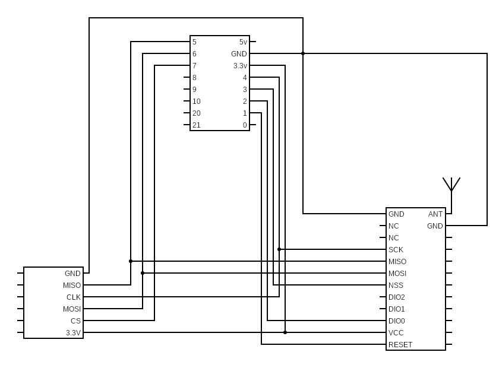

# DIY_LoRa_ESP V2.0
Self build ESP32 + LoRa device for environment monitoring on the Amazon Rainforrest.

This device uses the ESP32 C3 Mini microcontroller and the transciver 2AD66-LORAV2.
The microcontroller was changed for SD card support.

